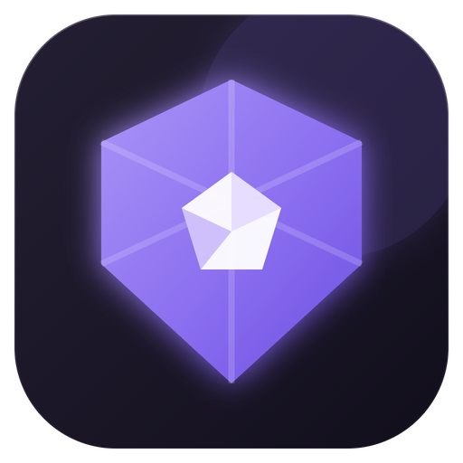
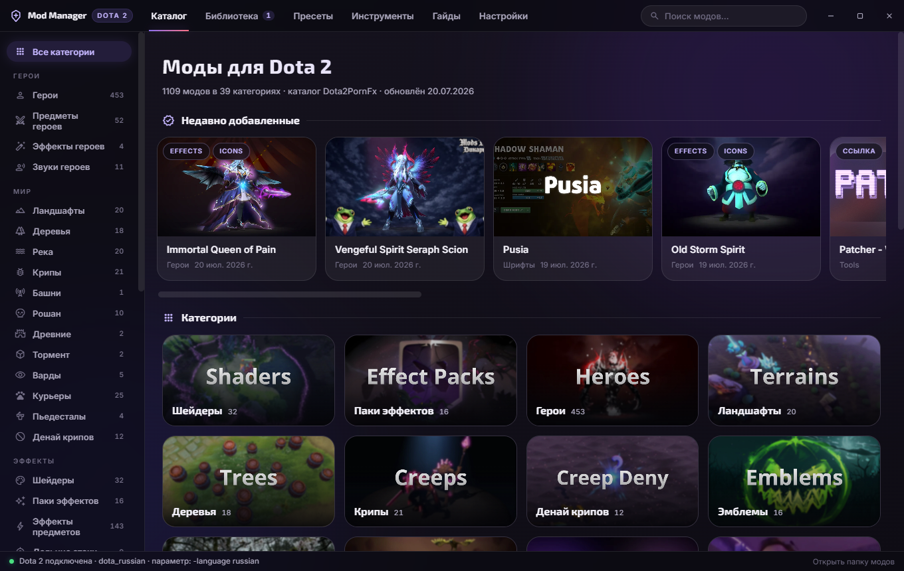
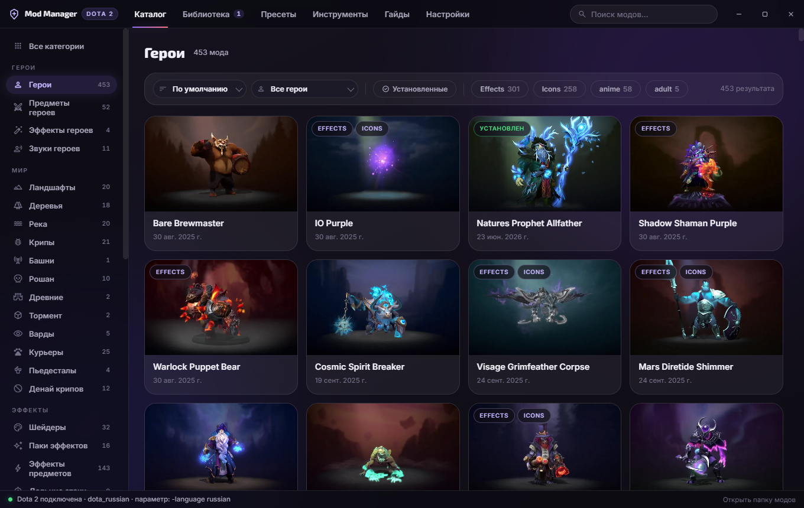
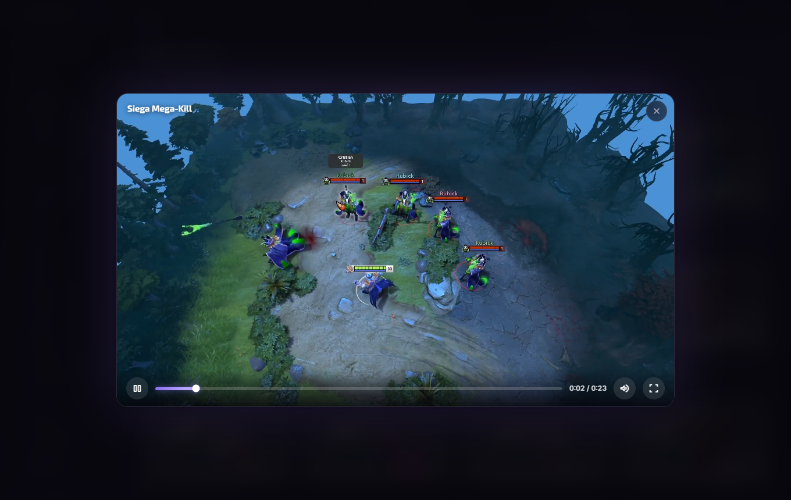
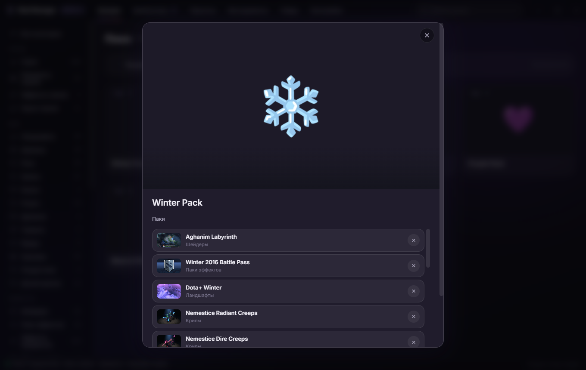

<div align="center">
  

  <h1>Dota 2 Mod Manager</h1>

  <p><b>Desktop mod launcher for Dota 2</b> — browse, install, toggle and manage 1100+ cosmetic mods in a couple of clicks. No manual file copying, no pak renaming, no guesswork.</p>

  <p>
    <a href="https://github.com/TheFleece/dota2-mod-manager/releases/latest">
      
    </a>
    
    
  </p>

  
</div>

---

## Features

| | |
|---|---|
| 🗂️ **Full catalog** | 1100+ mods in 40 categories — heroes, terrains, shaders, fonts, cursors, announcers, music and more, always in sync with the [Dota2PornFx](https://github.com/h6rd/Dota2PornFxWeb) repository |
| ⚡ **One-click install** | Downloads the mod and places it into the game automatically: pak slots are allocated for you, priority mods get `!pak` names, terrain `maps/` folders are handled |
| 🎬 **Built-in previews** | Watch video and listen to audio previews in a styled in-app player without leaving the catalog |
| 📚 **Library** | Everything installed at a glance — toggle mods on/off without deleting, remove them cleanly, spot files installed outside the manager |
| 🎯 **Filters & search** | Sort by date/name, filter by tags, by hero, by installed state; global search across all categories |
| 📦 **Packs** | Themed mod packs with full contents view — exclude items you don't want, save your own custom packs |
| ⭐ **Presets** | Save named sets of enabled mods and switch between them in one click |
| 🔤 **Fonts & cursors** | Installed directly into game files with automatic backup of the originals — removal restores vanilla |
| 🛠️ **Tools** | Download and launch community utilities (Background Changer, ItemsFix, Compiler…) from inside the app |
| 🔄 **Auto-updates** | The app checks GitHub Releases and updates itself when a new version is out |

<div align="center">
  
  
</div>

## Installation

1. Download **`Dota 2 Mod Manager Setup`** from the [latest release](https://github.com/TheFleece/dota2-mod-manager/releases/latest)
2. Run it — the app installs, creates a desktop shortcut and starts automatically
3. The app finds your Dota 2 installation by itself (configurable in Settings)
4. Add the launch option shown in **Settings** to Steam (`Steam → Dota 2 → Properties → Launch Options`), e.g.:

```
-language russian
```

> **Why a launch option?** Mods load from a custom language folder (`game/dota_russian`, `dota_123`, …).
> If you play with the Russian game language, use `dota_russian` / `-language russian` — the game stays Russian and mods work.
> Fonts and cursors work without any launch option.

## How it works

The app implements the same installation mechanics as the Dota2PornFx guides:

- VPK mods are placed into `steamapps/common/dota 2 beta/game/dota_<suffix>/` as `pakNN_dir.vpk` (slots 10–99, allocated automatically)
- Priority categories (trees, river, shaders, hero fx, ranged attack, hero items, optimization) get `!pakNN` names so they load first
- Terrains ship a `maps/` folder which is placed alongside the paks
- Fonts go to `game/dota/panorama/fonts`, cursors to `game/dota/resource/cursor` — originals are backed up and restored on removal
- Disabling a mod renames its file to `.off` — the game ignores it, nothing is lost

Downloads are cached in `%APPDATA%/dota2-mod-manager/downloads`, the install manifest lives in `manifest.json` next to it.

<div align="center">
  
</div>

## 🇷🇺 Установка

1. Скачай **`Dota 2 Mod Manager Setup`** из [последнего релиза](https://github.com/TheFleece/dota2-mod-manager/releases/latest)
2. Запусти — приложение установится, создаст ярлык и откроется само
3. Путь к Dota 2 находится автоматически
4. Добавь параметр запуска из **Настроек** в Steam (`Steam → Dota 2 → Свойства → Параметры запуска`):

```
-language russian
```

> Играешь на русском — используй `dota_russian` / `-language russian`: игра останется русской, моды будут работать. Шрифты и курсоры работают без параметра запуска.

## Development

```bash
git clone https://github.com/TheFleece/dota2-mod-manager.git
cd dota2-mod-manager
npm install
npm start        # run from source
npm run dist     # build the Windows installer
```

Stack: Electron, plain HTML/CSS/JS renderer, no build step for the UI.

## Credits

- **All mods, previews, guides and the catalog** come from the amazing open-source
  [**Dota2PornFxWeb**](https://github.com/h6rd/Dota2PornFxWeb) repository by [h6rd](https://github.com/h6rd)
  and the Dota 2 modding community — this app is a desktop client for their catalog.
  Mod authors are credited inside the app on each mod card.
- Community tools (VPKMerge, Background Changer, Compiler, ItemsFix) belong to their respective authors.

## License

[GPL-3.0](LICENSE) — free and open source. Catalog content is distributed under the same license by the
[upstream repository](https://github.com/h6rd/Dota2PornFxWeb).

*This project is not affiliated with Valve Corporation or Dota 2. Modifying game files is done at your own risk.*
