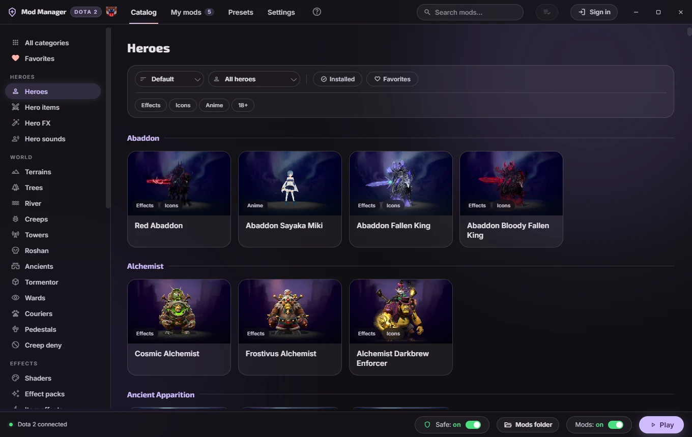

<div align="center">
  

  <h1>Dota 2 Mod Manager</h1>

  <p><b>Mods for Dota 2, without the file juggling.</b><br>
  1000+ skins, terrains, announcers and music in one catalog. Free cosmetics the game
  already ships. Setups you can hand to a friend as a link.</p>

  <p>
    <a href="https://github.com/TheFleece/dota2-mod-manager/releases/latest/download/Dota-2-Mod-Manager-Setup.exe">
      
    </a>
    
    
    <a href="https://dota2modmanager.com">
      
    </a>
  </p>

  
</div>

> **Why not just copy the files yourself?** You can, and people do. What the app adds is
> everything after that: switching a mod off before a match without deleting it, free
> cosmetics read from the game's own item table, a setup you send as one link, and a game that
> still works after a Dota patch.

---

## What it does

| | What it means |
|---|---|
| **The whole catalog** | 1000+ mods in 41 categories: heroes, terrains, shaders, fonts, cursors, announcers, music. Read live from the [Dota2PornFx](https://github.com/h6rd/Dota2PornFxWeb) repository, so new mods appear without an app update |
| **One click in, one click out** | The app downloads the mod, picks a free pak slot and cleans up after itself. Categories that have to load early get low slots by themselves |
| **An install list** | Put mods aside while you browse and install them all at once. The list has its own search, because people were installing eighty mods one at a time |
| **My mods** | Switch a mod off before a match and back on after, without deleting it. Rare actions live under the right mouse button, and the load order is always there |
| **Free cosmetics** | Weather, couriers, wards, loading screens, announcers, mega-kills, read from the game's own item table, so anything Valve adds appears by itself |
| **It says when mods collide** | Two mods that carry the same file cannot both win. The app names the file, says which mod the game is loading it from, and lets you change the order |
| **Filters and search** | Chips for what a mod changes, a dropdown for the item slot, a list of heroes, and one search across the whole catalog |
| **Setups by link** | Save the mods you run as a preset and send it in one message. One button, with the link ready and the file next to it |
| **Fonts and cursors** | Installed into the game files with a backup of the originals; removing them restores vanilla |
| **It survives Dota patches** | The app notices a game update when it lands, puts back what the patch wiped, and never writes to the game folder while Dota is running |
| **Auto-updates** | The app checks GitHub Releases and installs new versions itself |

<div align="center">
  
  
</div>

## Installation

1. Download **[Dota 2 Mod Manager Setup](https://github.com/TheFleece/dota2-mod-manager/releases/latest/download/Dota-2-Mod-Manager-Setup.exe)** (direct link, always the latest version)
2. Run it. The app installs, creates a desktop shortcut and starts
3. It finds your Dota 2 installation on its own (you can change the path in Settings)
4. That is all. No launch options and no Steam properties to edit

Windows will warn you that the publisher is unknown, because the installer is not signed with
a paid certificate. Click **More info**, then **Run anyway**. Every release is built from this
source by a [public workflow](https://github.com/TheFleece/dota2-mod-manager/actions), not
uploaded from anybody's desktop, and you can read the build log for the file you downloaded.

## How it works

The app follows the same installation mechanics as the Dota2PornFx guides:

- Dota mounts the folder named after its **voice** language, so that folder is where mods have
  to live. The app keeps the voices Russian and puts mods in `game/dota_russian`, which is why
  it no longer asks you anything about languages. Mods stranded in another folder by an older
  version are moved over on the first start
- English voices are a switch in Settings. Turning it on takes Valve's own `pak01_dir.vpk` out
  of the mounted folder and leaves every mod in place
- VPK mods go into `steamapps/common/dota 2 beta/game/dota_russian/` as `pakNN_dir.vpk`; the
  app assigns slots 10 to 99
- Categories that have to load first (trees, river, shaders, hero fx, ranged attack, hero
  items, optimization) get low slots `pak02` to `pak09`
- Terrains ship a `maps/` folder, placed next to the paks
- Fonts go to `game/dota/panorama/fonts`, cursors to `game/dota/resource/cursor`; the app backs
  up the originals and restores them on removal
- Switching a mod off renames its file to `.off`; the game skips it, the file stays
- Everything that writes to the game folder does so as one transaction. If a step fails, the
  whole change is rolled back, including files that were displaced to make room

Downloads live in `%APPDATA%/dota2-mod-manager/downloads`, the install manifest in
`manifest.json` next to it.

The same mechanics written for people rather than for a README:
[installing mods](https://dota2modmanager.com/docs/install/),
[what a VPK is and how the pak number decides which mod wins](https://dota2modmanager.com/docs/vpk/),
[what the item schema unlocks](https://dota2modmanager.com/docs/cosmetics/),
[whether any of it is safe](https://dota2modmanager.com/docs/safe/).

## Установка (Russian)

1. Скачай **[Dota 2 Mod Manager Setup](https://github.com/TheFleece/dota2-mod-manager/releases/latest/download/Dota-2-Mod-Manager-Setup.exe)** (прямая ссылка, всегда последняя версия)
2. Запусти. Приложение установится, создаст ярлык и откроется
3. Путь к Dota 2 находится автоматически
4. Всё. Никаких параметров запуска и правок свойств Steam

Windows скажет, что издатель неизвестен: установщик не подписан платным сертификатом. Нажми
**Подробнее**, затем **Выполнить в любом случае**. Каждый релиз собирается из этих исходников
[публичным workflow](https://github.com/TheFleece/dota2-mod-manager/actions), а не заливается
с чьего-то компьютера, и лог сборки твоего файла можно открыть и прочитать.

Приложение само держит озвучку русской и ставит моды в `game/dota_russian`, потому что игра
монтирует только папку языка озвучки. Английские голоса включаются тумблером в Настройках, и
моды при этом остаются на месте. Параметр `-language` после июльского апдейта Dota 2026 ставит
язык в настройках игры, а не называет папку напрямую, поэтому выдуманное значение вроде
`-language mods` больше ничего не монтирует.

Подробнее и по-человечески: [установка модов](https://dota2modmanager.com/ru/docs/install/),
[что такое VPK и почему побеждает меньший номер pak](https://dota2modmanager.com/ru/docs/vpk/),
[что открывает таблица предметов](https://dota2modmanager.com/ru/docs/cosmetics/),
[безопасно ли это](https://dota2modmanager.com/ru/docs/safe/).

## Development

```bash
git clone https://github.com/TheFleece/dota2-mod-manager.git
cd dota2-mod-manager
npm install
npm start        # run from source
npm test         # unit tests for the code that writes to the game folder
npm run dist     # build the Windows installer
```

Stack: Electron, plain HTML/CSS/JS renderer, no build step for the UI.

There is a throwaway Dota tree for development: `npm run sandbox:seed` builds it and downloads
real catalog mods into it, `npm run start:sandbox` runs the app against it, and
`npm run sandbox:reset` puts it back. Nothing in it touches a real game install.

Releases build automatically: push a `v*` tag and GitHub Actions compiles the installer and
publishes it. Installed apps pick the update up on their own.

## Credits

- **All mods, previews, guides and catalog data** come from the open-source
  [**Dota2PornFxWeb**](https://github.com/h6rd/Dota2PornFxWeb) repository by [h6rd](https://github.com/h6rd)
  and the Dota 2 modding community. This app is a desktop client for their catalog.
  Each mod card in the app credits its author.
- Community tools (VPKMerge, Background Changer, Compiler, ItemsFix) belong to their authors.

## License

[GPL-3.0](LICENSE), free to use, modify and share. Catalog content carries the same license in the
[upstream repository](https://github.com/h6rd/Dota2PornFxWeb).

*Not affiliated with Valve Corporation. You modify game files at your own risk.*
