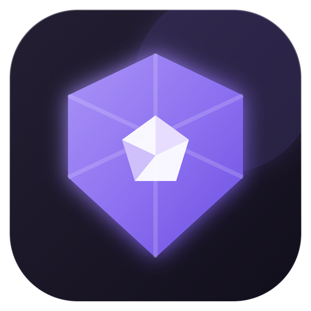
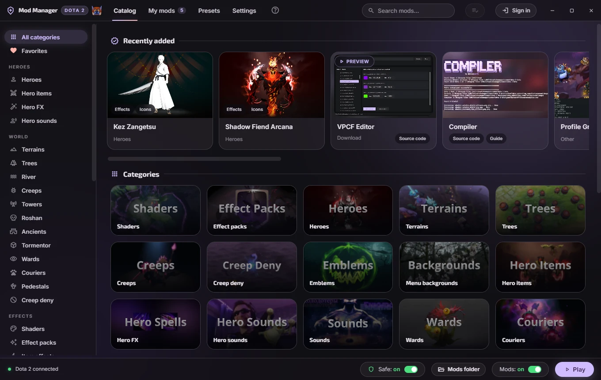
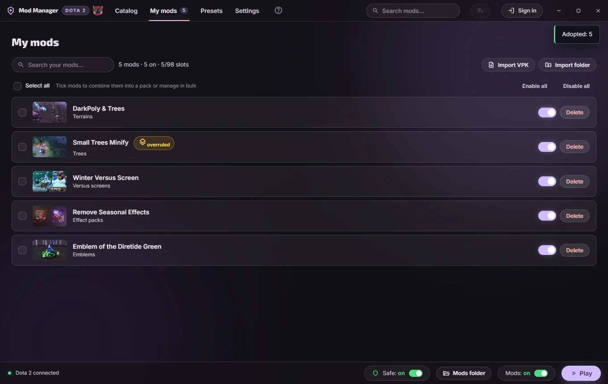

<div align="center">
  

  <h1>Dota 2 Mod Manager</h1>

  <p><b>Mods for Dota 2, without the file juggling.</b><br>
  1000+ skins, terrains, announcers and music in one catalog. Free cosmetics the game
  already ships. Setups you can hand to a friend as a link.</p>

  <p>
    <a href="https://github.com/TheFleece/dota2-mod-manager/releases/latest/download/Dota-2-Mod-Manager-Setup.exe">
      
    </a>
    
    <a href="https://github.com/TheFleece/dota2-mod-manager/actions/workflows/test.yml">
      
    </a>
    
    
    
    <a href="https://dota2modmanager.com">
      
    </a>
  </p>

  
</div>

> **Why not just copy the files yourself?** You can, and people do. What the app adds is
> everything after that: switching a mod off before a match without deleting it, free
> cosmetics read from the game's own item table, a setup you send as one link, and a game that
> still works after a Dota patch.

---

## What it does

| | What it means |
|---|---|
| **The whole catalog** | 1000+ mods in 41 categories: heroes, terrains, shaders, fonts, cursors, announcers, music. Read live from the [Dota2PornFx](https://github.com/h6rd/Dota2PornFxWeb) repository, so new mods appear without an app update |
| **One click in, one click out** | The app downloads the mod, picks a free pak slot and cleans up after itself. Categories that have to load early get low slots by themselves |
| **An install list** | Put mods aside while you browse and install them all at once. The list has its own search, because people were installing eighty mods one at a time |
| **My mods** | Switch a mod off before a match and back on after, without deleting it. Rare actions live under the right mouse button, and the load order is always there |
| **Free cosmetics** | Weather, couriers, wards, loading screens, announcers, mega-kills, read from the game's own item table, so anything Valve adds appears by itself |
| **It says when mods collide** | Two mods that carry the same file cannot both win. The app names the file, says which mod the game is loading it from, and lets you change the order |
| **Filters and search** | Chips for what a mod changes, a dropdown for the item slot, a list of heroes, and one search across the whole catalog |
| **Setups by link** | Save the mods you run as a preset and send it in one message. One button, with the link ready and the file next to it |
| **Fonts and cursors** | Installed into the game files with a backup of the originals; removing them restores vanilla |
| **It survives Dota patches** | The app notices a game update when it lands, puts back what the patch wiped, and never writes to the game folder while Dota is running |
| **Auto-updates** | The app checks GitHub Releases and installs new versions itself |
| **Windows and Linux** | Both ship with every release: an installer and a portable build for Windows, an AppImage for Linux. Steam is found wherever your distribution keeps it, flatpak included |

<div align="center">
  
  
</div>

## Installation

1. Download **[Dota 2 Mod Manager Setup](https://github.com/TheFleece/dota2-mod-manager/releases/latest/download/Dota-2-Mod-Manager-Setup.exe)** (direct link, always the latest version)
2. Run it. The app installs, creates a desktop shortcut and starts
3. It finds your Dota 2 installation on its own (you can change the path in Settings)
4. That is all. No launch options and no Steam properties to edit

**On Linux** the same app ships as an
[AppImage](https://github.com/TheFleece/dota2-mod-manager/releases/latest/download/Dota-2-Mod-Manager.AppImage):
`chmod +x` it and run it. Dota's Linux build keeps its mods in the same folders, and the app
finds Steam wherever your distribution put it, including the flatpak one.

Windows will warn you that the publisher is unknown, because the installer is not signed with
a paid certificate. Click **More info**, then **Run anyway**. Every release is built from this
source by a [public workflow](https://github.com/TheFleece/dota2-mod-manager/actions), not
uploaded from anybody's desktop, and you can read the build log for the file you downloaded.

## How it works

The app follows the same installation mechanics as the Dota2PornFx guides:

- Dota mounts one folder, named after its **voice** language, and that is where mods have to
  live. The app sets that language in the game's own settings and puts mods in
  `game/dota_russian`, so it never asks you anything about languages. Mods stranded in another
  folder by an older version are moved over on the first start
- **No launch option is involved**, which is the part worth reading twice. See
  [the method](#the-method-no-launch-option) below
- VPK mods go into `steamapps/common/dota 2 beta/game/dota_russian/` as `pakNN_dir.vpk`; the
  app assigns slots 10 to 99
- Categories that have to load first (trees, river, shaders, hero fx, ranged attack, hero
  items, optimization) get low slots `pak02` to `pak09`
- Terrains ship a `maps/` folder, placed next to the paks
- Fonts go to `game/dota/panorama/fonts`, cursors to `game/dota/resource/cursor`; the app backs
  up the originals and restores them on removal
- Switching a mod off renames its file to `.off`; the game skips it, the file stays
- Everything that writes to the game folder does so as one transaction. If a step fails, the
  whole change is rolled back, including files that were displaced to make room

- The pak slots `65`, `66` and `67` are never used, because [Minify](https://github.com/Egezenn/dota2-minify)
  writes them. See below

Downloads live in `%APPDATA%/dota2-mod-manager/downloads`, the install manifest in
`manifest.json` next to it.

## The method: no launch option

Every guide for installing Dota mods today tells you to put `-language something` in Steam's
launch options. That is the older way, and after Valve's update of 24 July 2026 it is the
awkward one. This app does not use it, and here is why it does not have to.

Dota records hero speech in **four** languages: English, Russian, Simplified Chinese, Korean.
**Three** of them have a folder in the game directory - `dota_russian`, `dota_schinese`,
`dota_koreana`. English has none, because English speech is what the base game already
carries. Every other language Dota offers, Dutch and German and the rest, is text only: no
recorded speech, so no folder.

Two settings decide what happens, and they are not the same setting:

- the language in Dota's **Steam properties** decides which voice pack is downloaded to your
  disk. Steam keeps exactly one: choose Korean and it deletes the Russian pack and downloads
  the Korean, gigabytes each way. English downloads nothing, because it is already there
- the **audio language inside the game** decides which pack it plays. If that pack is not on
  disk, it falls back to English

Those three folders exist for everybody who has Dota, downloaded pack or not. So the app sets
the audio language in the game to one of the three and installs there. For anybody whose Steam
language is English, the pack was never downloaded: the folder mounts carrying nothing but
mods, and the speech stays English because English is the fallback. Nothing about what you
hear changes, and your text language stays whatever you set it to.

The launch-option route reaches the same folder mechanism by a worse road. `-language dutch`
mounts `dota_dutch`, but that folder does not exist until something creates it with a
`gameinfo.gi` of its own; the argument locks both language settings while it is there, so
getting English text back needs an archive of the English localization dropped into that
folder; and a program that sets this up has to write into Steam's own configuration. Valve
have already stopped mounting folders invented out of nothing - the languages with no speech
of their own are the closest thing left to that, while the three with speech have to be
mounted for the speech to play at all.

If you have a `-language` in your launch options from an older guide, the app tells you: while
it is there Dota takes both language settings from it and mounts the folder it names, whatever
the app sets.

The long version, with the questions people actually ask:
[the language folder](https://dota2modmanager.com/docs/language/).

## Next to Minify

[Dota2 Minify](https://github.com/Egezenn/dota2-minify) is a different kind of tool - it
compiles mods where this installs them from a catalog - and the two are meant to run side by
side. They put their work in front of the game by different routes, and the difference is
worth writing down.

Dota has four voice languages and three folders that mount: `dota_russian`, `dota_schinese`,
`dota_koreana`. There is no English folder, because English is what the base game already
carries - which is also why English is what you hear whenever the chosen voice pack is not on
disk, and Steam only ever keeps one of those packs at a time.

**This app** sets the voice language in Dota's own settings to one of those three and fills
that folder. The folders are already there on every install; somebody whose Steam language is
English has no Russian voice pack, so the folder mounts as an empty carrier, their mods load
out of it, and they go on hearing English. No launch parameters, no folder created by hand, no
VPK to undo a side effect, and the text language stays theirs to choose.

**Minify** puts `-language <locale>` in Steam's launch options and fills the folder that names.
That parameter locks both language settings while it is set, so the English text has to be
given back by a VPK it ships for the purpose, the folder has to be created with a `gameinfo.gi`
of its own, and the app has to write into Steam's config to set it up.

Only one language folder is ever mounted, so the two can be pointed at the same one or at
different ones. This app:

- reads the configuration Minify keeps and works out which of the two the game is set to read,
  then says so on the My mods screen - including the case where its folder is not one the game
  reads at all, which is not a conflict with anything
- leaves `pak65`, `pak66`, `pak67` and `pak99` alone. The first three are reserved in Minify's
  [ARCHITECTURE.md](https://github.com/Egezenn/dota2-minify/blob/main/ARCHITECTURE.md) for its
  merged, compiled and catalog output; the fourth is where its English fix is written. Mods
  from both can sit in one folder without either writing over the other
- never moves, renames or deletes anything Minify owns, and copies none of its features. Its
  files are recognised by the marker it packs into what it builds, and this app leaves a
  `dota2modmanager.json` naming its own, so either side can tell whose a file is
- asks first where the two genuinely cannot both win: Dota reads one map archive, and a
  terrain and a Minify map mod are the same `maps/dota.vpk`. Installing one replaces the
  other, so the app says whose work is about to go instead of doing it quietly

Both projects are clients of the same catalog: Minify browses
[Dota2PornFx](https://github.com/h6rd/Dota2PornFxWeb) too, and links to it from its own page.

## Установка (Russian)

1. Скачай **[Dota 2 Mod Manager Setup](https://github.com/TheFleece/dota2-mod-manager/releases/latest/download/Dota-2-Mod-Manager-Setup.exe)** (прямая ссылка, всегда последняя версия)
2. Запусти. Приложение установится, создаст ярлык и откроется
3. Путь к Dota 2 находится автоматически
4. Всё. Никаких параметров запуска и правок свойств Steam

**На Linux** это [AppImage](https://github.com/TheFleece/dota2-mod-manager/releases/latest/download/Dota-2-Mod-Manager.AppImage):
`chmod +x` и запускай. Моды у линуксовой Доты лежат в тех же папках, Steam приложение находит
само, включая flatpak.

Windows скажет, что издатель неизвестен: установщик не подписан платным сертификатом. Нажми
**Подробнее**, затем **Выполнить в любом случае**. Каждый релиз собирается из этих исходников
[публичным workflow](https://github.com/TheFleece/dota2-mod-manager/actions), а не заливается
с чьего-то компьютера, и лог сборки твоего файла можно открыть и прочитать.

Приложение само ставит язык озвучки в настройках игры и кладёт моды в `game/dota_russian`,
потому что игра монтирует одну папку - названную по языку озвучки. **Параметр запуска при этом
не нужен вообще.** Голоса у англоязычных остаются английскими: русская озвучка у них не
скачана, поэтому папка монтируется пустым носителем для модов, а речь берётся из самой игры.
Четыре языка озвучки, три папки, почему английской папки нет и чем плох путь через
`-language` - в разделе «The method: no launch option» выше и на странице
[языковая папка](https://dota2modmanager.com/ru/docs/language/).

Подробнее и по-человечески: [установка модов](https://dota2modmanager.com/ru/docs/install/),
[что такое VPK и почему побеждает меньший номер pak](https://dota2modmanager.com/ru/docs/vpk/),
[что открывает таблица предметов](https://dota2modmanager.com/ru/docs/cosmetics/),
[безопасно ли это](https://dota2modmanager.com/ru/docs/safe/).

## Development

```bash
git clone https://github.com/TheFleece/dota2-mod-manager.git
cd dota2-mod-manager
npm install
npm start        # run from source
npm test         # unit tests for the code that writes to the game folder
npm run dist     # build the Windows installer
```

Stack: Electron, plain HTML/CSS/JS renderer, no build step for the UI.

There is a throwaway Dota tree for development: `npm run sandbox:seed` builds it and downloads
real catalog mods into it, `npm run start:sandbox` runs the app against it, and
`npm run sandbox:reset` puts it back. Nothing in it touches a real game install.

Releases build automatically: push a `v*` tag and GitHub Actions compiles the installer and
publishes it. Installed apps pick the update up on their own.

[ARCHITECTURE.md](ARCHITECTURE.md) is the map: how a mod gets from a click to a file in the game
folder, why every write is a transaction, and what each module owns.
[CONTRIBUTING.md](CONTRIBUTING.md) covers the rest, including the one rule that matters most, which
is that you test against the sandbox and never against your own installation.

Pull requests are welcome. Issues tagged
[good first issue](https://github.com/TheFleece/dota2-mod-manager/labels/good%20first%20issue) are
the ones with a known shape and no archaeology needed.

## Credits

- **All mods, previews, guides and catalog data** come from the open-source
  [**Dota2PornFxWeb**](https://github.com/h6rd/Dota2PornFxWeb) repository by [h6rd](https://github.com/h6rd)
  and the Dota 2 modding community. This app is a desktop client for their catalog.
  Each mod card in the app credits its author.
- Community tools (VPKMerge, Background Changer, Compiler, ItemsFix) belong to their authors.
- **[hanta](https://www.youtube.com/@hqnta)** filmed a
  [walkthrough of the app](https://www.youtube.com/watch?v=Z_yalpuP6pA) in Russian, which
  answers more questions than this README does for anyone who would rather watch than read.

## License

[GPL-3.0](LICENSE). Copyright (C) 2026 Mykhailo Lynnyk.

Fork it, change it, ship your own. GPL-3.0 asks you to keep the copyright line, to say in your
project that you changed the code and when, and to open your version under the same license.
Section 7 of that license lets an author add two more, and this repository does: keep the credit
the app shows, and pick your own name for your version. [NOTICE](NOTICE) puts all of it in plain
words.

Catalog content belongs to [h6rd](https://github.com/h6rd/Dota2PornFxWeb) and the mod authors,
under the same license in their repository.

*Not affiliated with Valve Corporation. You modify game files at your own risk.*
