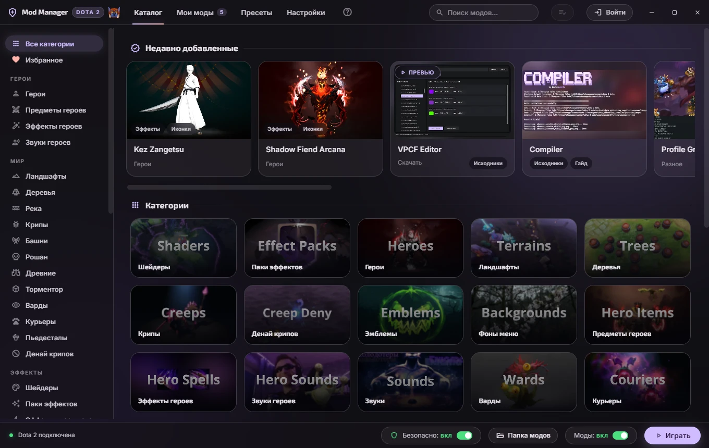

  

  <h1>Dota 2 Mod Manager</h1>

  
<b>Моды для Доты 2 без возни с файлами.</b> 
  1000+ скинов, ландшафтов, аннонсеров и музыки в одном каталоге. Бесплатная косметика, которая
  уже есть в игре. Сборка, которую отправляешь другу одной ссылкой.

  

    
    
    
    
  

  

    <a href="#что-умеет">Возможности</a> ·
    <a href="#установка">Установка</a> ·
    <a href="#как-это-работает">Как это работает</a> ·
    <a href="#рядом-с-dota2-minify">Рядом с Minify</a> ·
    <a href="#документация">Документация</a> ·
    <a href="README.md">English</a>
  

  

> [!NOTE]
> С Valve не связаны. Все моды здесь клиентские: их не видит никто, кроме тебя, и чужую игру они
> не трогают. Безопасный режим включён по умолчанию и вообще не пускает приложение в файлы Доты;
> единственная функция, которая их меняет, сначала спрашивает и откатывается байт в байт.

## Что умеет

| | |
|---|---|
| **Весь каталог** | 1000+ модов в 41 категории, читается вживую из репозитория [D2PFX](https://github.com/h6rd/Dota2PornFxWeb), поэтому мод, добавленный сегодня, сегодня же и ставится |
| **Один клик туда, один обратно** | Приложение скачивает мод, занимает свободный слот pak и убирает за собой. Категории, которым надо грузиться раньше, сами получают низкие слоты |
| **Выключить, а не удалять** | Выключи мод перед матчем и включи после. Библиотека остаётся, папка игры остаётся чистой |
| **Бесплатная косметика** | Погода, курьеры, варды, экраны загрузки, аннонсеры, мега-киллы — читаются из таблицы предметов самой игры, поэтому всё новое от Valve появляется само |
| **Говорит, когда моды конфликтуют** | Два мода с одним и тем же файлом не могут победить оба. Приложение называет файл, говорит, из какого мода игра его берёт, и даёт поменять порядок |
| **Сборки ссылкой** | Сохрани то, что стоит, пресетом и отправь одним сообщением. На той стороне откроют и получат тот же вид |
| **Переживает патчи Доты** | Приложение замечает обновление игры и возвращает то, что патч стёр, и никогда не пишет, пока Дота запущена |

<b>И остальное</b>

| | |
|---|---|
| **Список установки** | Откладывай моды, пока смотришь каталог, и поставь все разом. У списка свой поиск: люди ставили по восемьдесят модов по одному |
| **Фильтры и поиск** | Чипы по тому, что мод меняет, выпадашка по слоту предмета, список героев и один поиск по всему каталогу |
| **Шрифты и курсоры** | Ставятся в файлы игры с бэкапом оригиналов; удаление возвращает ваниль |
| **Объединённые паки** | Слепи несколько модов в один слот и разбери обратно |
| **Свои файлы** | Импортируй `.vpk` или подхвати то, что оставила в папке чужая программа. Приложение сверит отпечаток с каталогом и скажет, что это |
| **Автообновление** | Приложение само смотрит GitHub Releases и ставит новые версии |
| **Windows и Linux** | Оба в каждом релизе: установщик и портативная сборка под Windows, AppImage под Linux. Steam находится сам, включая flatpak |
| **Без аккаунта и телеметрии** | Ничего не собирается и никуда не уходит. Вход через Discord необязателен и нужен только чтобы подписать сборку, которой делишься |

## Установка

1. Скачай **[Dota 2 Mod Manager Setup](https://github.com/TheFleece/dota2-mod-manager/releases/latest/download/Dota-2-Mod-Manager-Setup.exe)** — прямая ссылка, всегда последняя версия
2. Запусти. Приложение установится, создаст ярлык и откроется
3. Путь к Доте найдётся сам. Никаких параметров запуска и правок свойств Steam

**На Linux** это [AppImage](https://github.com/TheFleece/dota2-mod-manager/releases/latest/download/Dota-2-Mod-Manager.AppImage):
`chmod +x` и запускай.

> [!IMPORTANT]
> Windows скажет, что издатель неизвестен: у установщика нет платной подписи. Жми **Подробнее**,
> потом **Выполнить в любом случае**. Каждый релиз собирается из этих исходников
> [публичным воркфлоу](https://github.com/TheFleece/dota2-mod-manager/actions/workflows/release.yml),
> а не заливается с чьего-то компьютера, и лог сборки ровно того файла, что ты скачал, открыт.

## Как это работает

В процесс Доты ничего не внедряется, и ни один файл игры не открывается, пока она запущена.

- Дота монтирует **одну** папку, названную по языку **озвучки**. Приложение ставит этот язык в
  настройках самой игры и туда же ставит моды — **без параметра запуска**, и это стоит перечитать
  дважды. [Почему так работает](https://dota2modmanager.com/ru/docs/language/)
- VPK-моды ложатся как `pakNN_dir.vpk`, слоты с 10 по 99. Кому надо грузиться первым, достаются
  `pak02`-`pak09`. [Слоты и порядок загрузки](https://dota2modmanager.com/ru/docs/vpk/)
- Выключенный мод переименовывается в `.off`: игра его пропускает, файл остаётся
- Шрифты и курсоры уезжают в папки игры, оригиналы сохраняются заранее
- Всё, что пишется в папку игры, делается одной транзакцией: упало на середине — откатывается
  целиком, вместе с файлами, которые подвинули
- Безопасный режим включён по умолчанию и означает, что приложение не трогает файлы Доты. Если
  его выключить, добавляется одна строка в `gameinfo_branchspecific.gi` и подпись в
  `dota.signatures` — обе сохраняются до первой правки и возвращаются байт в байт.
  [Что это даёт и чего стоит](https://dota2modmanager.com/ru/docs/safe/)

Загрузки лежат в `%APPDATA%/dota2-mod-manager/downloads`, манифест установки рядом.

## Рядом с Dota2 Minify

[Dota2 Minify](https://github.com/Egezenn/dota2-minify) — инструмент другого рода и другого
автора: он собирает моды, патча саму игру, а это приложение ставит готовые из каталога.
**Держи обе.** Приложение ставит моды в ту папку, которую игра смонтирует на самом деле, включая
выбранную Minify, никогда не занимает его слоты паков и не трогает его файлы. Minify с версии
v1.14rc7 проверяет принадлежность перед чисткой папки карт, поэтому поставленный здесь ландшафт
переживает его удаление.

[Что такое Minify и как держать обе](https://dota2modmanager.com/ru/docs/minify/).

## Документация

| | |
|---|---|
| [Установка модов](https://dota2modmanager.com/ru/docs/install/) | Весь путь, руками и приложением |
| [Языковая папка](https://dota2modmanager.com/ru/docs/language/) | Почему `-language` не нужен и что он делает, когда стоит |
| [VPK и порядок загрузки](https://dota2modmanager.com/ru/docs/vpk/) | Слоты pak, кто побеждает и при чём тут `gameinfo.gi` |
| [Безопасный режим](https://dota2modmanager.com/ru/docs/safe/) | Что приложение пишет в игру, а что нет |
| [Бесплатная косметика](https://dota2modmanager.com/ru/docs/cosmetics/) | Таблица предметов: что она может дать, а что нет |
| [После патча Доты](https://dota2modmanager.com/ru/docs/troubleshooting/) | Что ломается и что приложение возвращает |
| [Все цифры, проверяемые](https://dota2modmanager.com/ru/facts/) | Версия, платформы, счётчики и как проверить каждую |

## Сообщить о проблеме

| | |
|---|---|
| [Баг](https://github.com/TheFleece/dota2-mod-manager/issues/new?template=bug_report.yml) | Что-то сломалось. **Настройки → Диагностика → Экспортировать отчёт** соберёт всё нужное в один файл |
| [Идея](https://github.com/TheFleece/dota2-mod-manager/issues/new?template=feature_request.yml) | Предложение, как приложение должно работать |
| [Discord](https://discord.gg/PBvG8D9MxT) | Вопросы и быстрая помощь, в сообществе каталога |
| [Безопасность](SECURITY.md) | Уязвимости — лично, никогда публичным issue |

Сначала две вещи: убедись, что стоит последняя версия, и если Дота недавно обновлялась — открой
приложение и дай ему вернуть патч на место.

## Благодарности

Все моды, превью, гайды и данные каталога приходят из открытого репозитория
[**D2PFX**](https://github.com/h6rd/Dota2PornFxWeb) от [h6rd](https://github.com/h6rd) и
сообщества моддеров Доты. Это приложение — десктопный клиент к их каталогу, и каждая карточка
мода в нём называет автора.

**[hanta](https://www.youtube.com/@hqnta)** снял
[разбор приложения](https://www.youtube.com/watch?v=Z_yalpuP6pA) — там ответов больше, чем на
этой странице, если удобнее посмотреть, чем читать.

## Лицензия

[GPL-3.0](LICENSE). Copyright (C) 2026 Mykhailo Lynnyk. Подробности и две добавки по седьмой
секции лицензии — в [NOTICE](NOTICE).

*С Valve Corporation не связаны. Файлы игры ты меняешь на свой страх и риск.*
